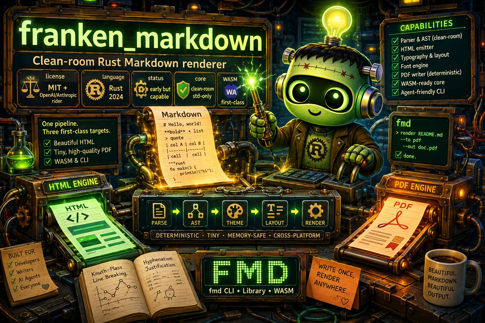

<div align="center">

# franken_markdown



**A clean-room, dependency-lean Rust Markdown renderer for beautiful all-in-one
HTML, tiny high-quality PDF, a standalone `fmd` CLI, and first-class WASM use.**


</div>

> **The HTML and PDF paths work today.** Markdown renders to
> self-contained HTML today, including clean-room syntax highlighting for common
> documentation languages. The PDF path produces compact, deterministic,
> embedded-subset-font documents with Knuth-Plass line breaking, real GPOS
> kerning and GSUB ligatures, deterministic Liang/TeX hyphenation and
> justification for body paragraphs, measured-column tables, nested lists, tinted
> blockquotes, strikethrough, heading rules, syntax-highlighted code panels, and
> selectable tagged-PDF text. The browser/WASM package builds a real
> wasm-bindgen module that loads in node and the browser and renders HTML and PDF
> with byte-identical parity to the native core; it is publish-ready (validated
> manifest plus a tag-gated npm release workflow), proven by
> `scripts/check-wasm-package.sh`. Deeper pagination controls remain active
> roadmap work tracked in beads.
> Version `0.1.0`. Prebuilt `fmd` binaries for Linux, macOS (Intel + Apple
> Silicon), and Windows are produced by the tag-gated
> `.github/workflows/release.yml` (with checksums and per-platform smoke tests);
> source builds remain available as a fallback under [Installation](#installation).

---

## TL;DR

**The problem.** Markdown preview looks great inside an editor like Cursor, but
turning that same Markdown into a portable HTML file and a polished PDF usually
means dragging in a headless browser, a giant document engine, a Python or Node
toolchain, C libraries, or hundreds of transitive Rust crates. Every one of
those is more to install, more to audit, and more that can drift or break.

**The solution.** `franken_markdown` owns the entire pipeline in pure Rust:
the Markdown parser, the AST, the theme model, the HTML emitter, the
typography and layout engine, the font subsystem, and the PDF writer. The engine
library has **zero third-party dependencies**; the only default dependency is
`clap`, and only for the CLI. The same render core compiles to native Rust, the
`fmd` binary, and browser/WASM, and it produces deterministic, byte-stable
output.

### Why franken_markdown?

| Goal | What you get |
|---|---|
| Beautiful by default | Cursor/GitHub-style theme, readable measure, polished tables, blockquotes, and code blocks; no config required |
| One theme, two surfaces | A single typed theme drives HTML and PDF, so colors, spacing, and code styling stay in sync |
| Tiny audit surface | Clean-room engine with no `comrak`, `pulldown-cmark`, `syntect`, `cosmic-text`, `krilla`, Typst, Blitz, or browser engine; `--no-default-features` builds with zero external crates |
| Real PDF typography | Embedded subset fonts, true metrics, GPOS kerning, GSUB ligatures, Knuth-Plass line breaking, Liang/TeX hyphenation and justification, tagged-PDF structure, and compressed streams |
| Deterministic | Fixed input plus fixed options yields identical bytes across runs and machines; `SOURCE_DATE_EPOCH` controls PDF dates |
| WASM-first | The core has no filesystem, fontconfig, process, thread, or async-runtime assumptions; fonts arrive as bytes |
| Agent-friendly CLI | `fmd README.md` just works; `capabilities --json`, `doctor --json`, `robot-docs guide`, and `--robot-triage` expose a stable machine contract |
| Cross-platform | Windows, macOS, Linux, and browser/WASM are all product targets |

---

## Quick Example

```bash
# Build the fmd binary from source
cargo build --release --bin fmd

# Render a Markdown file to self-contained HTML
target/release/fmd examples/showcase.md --out showcase.html

# Render from stdin, or from a raw string, with no temp file
target/release/fmd - --out stdin.html < examples/showcase.md
target/release/fmd --text '# Hello from fmd' --out hello.html
target/release/fmd --text '# Hello from fmd' --out - > piped.html

# Use the long-form serif theme instead of the default sans
target/release/fmd examples/showcase.md --font serif --out showcase-serif.html

# Render a compact, deterministic PDF with embedded subset fonts
target/release/fmd examples/showcase.md --to pdf --out showcase.pdf
target/release/fmd examples/showcase.md --to pdf --title "Showcase" --author "FMD" --out showcase.pdf

# Render HTML and PDF together (extensions derived from --out)
target/release/fmd examples/showcase.md --to both --out showcase.html

# Reproducible PDF metadata dates
SOURCE_DATE_EPOCH=1700000000 target/release/fmd examples/showcase.md --to pdf --out showcase.pdf

# Discover the machine-readable contract (for humans and agents alike)
target/release/fmd capabilities --json
target/release/fmd doctor --json
target/release/fmd robot-docs guide
target/release/fmd --robot-triage
```

The PDF path is honest about its stage. It produces valid, deterministic PDFs
today with embedded curated font subsets, real metrics, focused GPOS kerning,
GSUB ligatures, selectable text, link annotations, heading outlines,
title/author/`SOURCE_DATE_EPOCH` metadata, a hierarchical tagged-PDF structure
tree, and compressed page streams. The writer does Knuth-Plass line breaking,
deterministic discretionary hyphenation and glue justification for body
paragraphs, measured-column tables with per-cell alignment and zebra striping,
nested lists, tinted blockquotes, strikethrough, heading hairline rules, and
syntax-highlighted code panels. Full widow/orphan and richer block pagination
remain roadmap.

---

## Design Philosophy

1. **Focused beats general.** This is a Markdown renderer, not a browser, not a
   full HTML/CSS engine, and not a document programming language. Doing one
   workflow (`Markdown -> HTML and/or PDF`) exceptionally well is the whole goal.
2. **Own the hot path.** The parser, layout, font metrics, line breaking, and
   PDF writer are built for this exact workflow instead of inherited from large
   general-purpose stacks. That control is what makes the kerning, ligatures, and
   line breaking possible without a 300-crate dependency tree.
3. **A small, auditable surface.** The engine compiles with zero third-party
   crates; `clap` is the only default dependency and exists solely for the CLI.
   `scripts/check-policy.sh` enforces this in CI, and `unsafe` is forbidden at
   the crate level.
4. **Determinism is a feature, not an accident.** Given fixed input, theme,
   fonts, and options, output bytes are stable across runs and operating
   systems. `scripts/check-determinism.sh` compares repeated renders byte for
   byte, and `SOURCE_DATE_EPOCH` pins PDF dates.
5. **WASM is first-class, not a port.** The render core builds without the CLI
   feature and carries no filesystem, fontconfig, process, thread, or
   async-runtime assumptions. Fonts and stylesheets enter as bytes. Native and
   WASM renders are proven byte-identical over a corpus.
6. **Asupersync is for orchestration, not the core.** Structured concurrency,
   cancellation, and budgets live behind the native-only `batch` feature. The
   pure render path stays synchronous and embeddable.
7. **Agent ergonomics are part of the product.** The first command an agent
   guesses works, stdout is data, stderr is diagnostics, errors name the flag
   that fixes them, and a JSON contract is always one flag away.

---

## Comparison

Honest tradeoffs against the common ways people turn Markdown into HTML and PDF.

| Tool / approach | Real strength | Why `franken_markdown` exists |
|---|---|---|
| Headless Chrome (print to PDF) | Excellent browser fidelity | Heavy runtime, nondeterministic output, large attack surface; not suited to a tiny embeddable CLI/WASM renderer |
| Pandoc (+ LaTeX for PDF) | Extremely capable format conversion | Large external toolchain (Haskell, and usually a LaTeX install for PDF); not a small embeddable Rust/WASM library |
| Typst | Gorgeous typesetting | Different source language and a heavier stack; PDF-first rather than Markdown-preview-shaped |
| `comrak` / `pulldown-cmark` | Fast, conformant Markdown to HTML | HTML only, no PDF; you still bolt on a separate PDF stack and font tooling, and you cede control of layout |
| `comrak` + a PDF crate + `syntect` | A quick way to assemble a renderer | Pulls broad dependency forests (regex/onig, font stacks, PDF libs) and hands parser/layout/font/PDF behavior to code you do not control |
| `franken_markdown` | Focused Markdown to HTML/PDF | Clean-room, dependency-lean, deterministic, WASM-first, and tuned for one workflow end to end |

Where the others win: a headless browser will out-render arbitrary CSS, and
Pandoc converts far more formats. `franken_markdown` trades that breadth for a
small surface, fast builds, determinism, and a PDF path it controls top to
bottom.

---

## Installation

> The `curl`/PowerShell installers (`install.sh` / `install.ps1`) prefer
> prebuilt release archives and verify checksums when `SHA256SUMS` is published.
> Use `--from-source` / `-FromSource`, or the source commands below, only when
> you intentionally want to compile locally.

### One-line install (Unix: macOS, Linux)

```bash
curl -fsSL https://raw.githubusercontent.com/Dicklesworthstone/franken_markdown/main/install.sh | bash
```

### One-line install (Windows PowerShell)

```powershell
irm https://raw.githubusercontent.com/Dicklesworthstone/franken_markdown/main/install.ps1 | iex
```

The installer accepts flags (pass them after `| bash -s --` for the Unix
one-liner):

| Flag | Purpose |
|---|---|
| `--version <tag>` | Install a specific version instead of the latest |
| `--dest <dir>` | Install the binary to a chosen directory |
| `--system` | Install system-wide instead of into your user bindir |
| `--easy-mode` | Pick safe defaults and minimize prompts |
| `--verify` | Verify checksums/signatures before installing |
| `--from-source` | Build `fmd` from source rather than downloading a binary |
| `--quiet` | Suppress non-essential output |
| `--no-gum` | Skip the prettified prompts and use plain output |
| `--force` | Overwrite an existing install without asking |

### From source

```bash
git clone https://github.com/Dicklesworthstone/franken_markdown
cd franken_markdown

# Build just the fmd binary
cargo build --release --bin fmd
./target/release/fmd --help

# Or install it onto your PATH
cargo install --path .
fmd --help
```

`fmd` and the long alias `franken_markdown` are the same program built from one
shared entrypoint; type whichever you like.

### Prebuilt binaries and npm

Pushing a `v*` tag runs `.github/workflows/release.yml`, which builds,
smoke-tests, and attaches a `fmd` archive per platform — Linux
(`x86_64-unknown-linux-gnu`), macOS Intel (`x86_64-apple-darwin`) and Apple
Silicon (`aarch64-apple-darwin`), and Windows (`x86_64-pc-windows-msvc`) — each
with a `.sha256` and a combined `SHA256SUMS`. Download the archive for your
platform and verify it before unpacking (Linux example):

```bash
sha256sum -c fmd-vX.Y.Z-x86_64-unknown-linux-gnu.tar.gz.sha256
tar -xzf fmd-vX.Y.Z-x86_64-unknown-linux-gnu.tar.gz
```

The browser/WASM build publishes separately to npm as
`@franken-suite/franken-markdown` via `.github/workflows/release-wasm.yml`.

---

## Quick Start

1. **Build the binary.**

   ```bash
   cargo build --release --bin fmd
   ```

2. **Render your first HTML file.** With no `--out`, HTML goes to stdout, so
   redirect it or pass a path.

   ```bash
   target/release/fmd README.md --out README.html
   ```

3. **Render a PDF.** PDF cannot stream to stdout, so it needs a real path (or it
   derives one from the input name).

   ```bash
   target/release/fmd README.md --to pdf --out README.pdf
   ```

4. **Pick a theme or a custom stylesheet.**

   ```bash
   target/release/fmd README.md --font serif --out README.html
   target/release/fmd README.md --css mystyle.css --out README.html
   ```

5. **Persist a default so you do not repeat yourself.**

   ```bash
   target/release/fmd config set font serif --json
   ```

6. **Ask the tool what it can do.** No external docs required.

   ```bash
   target/release/fmd capabilities --json
   target/release/fmd robot-docs guide
   ```

---

## Command Reference

`fmd` exposes a small, stable command set. Global flags can appear on any
command.

### Global flags

| Flag | Meaning |
|---|---|
| `--json` | Emit stable machine-readable JSON for the command's status/metadata |
| `--no-color` | Disable decorative color (accepted for `NO_COLOR`/`CI`/`TERM=dumb` parity; current output is already plain) |
| `--no-config` | Ignore native config files for a reproducible, config-free invocation |
| `--robot-triage` | Print one JSON envelope: quick-reference commands, subsystem health, and recommended next actions |

Bare `fmd` prints help and exits successfully; it never opens a blocking TUI.
Common `--json` typos (`--jsno`, `--jason`, `--json=true`) and color spellings
(`--no-colour`, `--color=never`) are normalized before parsing.

### `render` (the default command)

Render a Markdown file, stdin, or a raw string to HTML and/or PDF. `render` is
implicit: `fmd README.md`, `fmd - < README.md`, and `fmd --text '# Hi' --out
hi.html` all route to it.

```bash
fmd render <input.md|-> [--to html|pdf|both] [--out PATH] [--font sans|serif] ...
fmd <input.md|->            # render is inferred
fmd --text '<markdown>' --out out.html
```

| Flag | Meaning |
|---|---|
| `<input>` (positional) | Input `.md` path, or `-` to read Markdown from stdin |
| `--text <markdown>` | Render a raw Markdown string directly, with no input file |
| `--to html\|pdf\|both` | Output format(s). Default `html` |
| `--out, -o <path>` | Output path. HTML with no `--out` (or `--out -`) writes to stdout. PDF and `--to both` always write files |
| `--font sans\|serif` | Override the body font for this render |
| `--css <file>` | Replace the default stylesheet entirely with your CSS (HTML) |
| `--title <text>` | Set the document title (otherwise the first heading, then "Document") |
| `--author <text>` | Set PDF author metadata |
| `--allow-html` | Pass raw HTML in the source through instead of escaping it (trusted input only) |
| `--pdf-line-numbers` | Render muted line numbers in PDF fenced code blocks |
| `--pdf-image DEST=PATH` | Resolve one Markdown image destination to a local file for PDF rendering; repeat for multiple images. The render core never reads files or fetches network resources itself |
| `--max-pdf-image-bytes <n>` | Max bytes accepted per `--pdf-image` file before rendering (default `33554432`, 32 MiB) |
| `--max-input-bytes <n>` | Refuse file/stdin/`--text` input above `n` bytes before parsing (default `67108864`, 64 MiB) |
| `--json` | Emit a stable JSON status envelope to stderr after writing outputs |

Output-path rules:

- HTML with no `--out`, or `--out -`, streams to stdout.
- PDF and `--to both` require a real file. With no `--out`, the path derives from
  the input stem (`doc.md` -> `doc.pdf`), or `document.*` for stdin/`--text`.
- `--out -` is refused for PDF and `--to both` (they cannot stream).

```bash
fmd README.md --out README.html
fmd README.md --to pdf --out README.pdf
fmd README.md --to pdf --pdf-line-numbers --out README.pdf
fmd README.md --to pdf --pdf-image images/chart.png=./chart.png --out README.pdf
fmd README.md --to both --out README.html        # writes README.html + README.pdf
fmd --max-input-bytes 1048576 README.md --out README.html
SOURCE_DATE_EPOCH=1700000000 fmd README.md --to pdf --out README.pdf
```

### `config`

Read or edit the native CLI config. This never touches the WASM/core renderer.

```bash
fmd config show [--json]            # show the resolved config + equivalent theme
fmd config get <key> [--json]       # print the resolved value of one key
fmd config set <key> <value> [--json]
fmd config path [--json]            # print the config file path
```

```bash
fmd config show --json
fmd config get font --json
fmd config set font serif --json
fmd config path --json
```

`config set` cannot be combined with `--no-config`. See
[Configuration](#configuration) for the supported keys.

### `capabilities`

Print the stable, machine-readable CLI contract: commands, examples, output
formats, exit codes, feature status, the theme model, and the CommonMark
conformance number.

```bash
fmd capabilities --json
```

### `doctor`

Report which subsystems are available or planned, the dependency posture, and
the license.

```bash
fmd doctor
fmd doctor --json
```

### `robot-docs guide`

Print a short, in-tool guide written for coding agents: canonical commands and
the rules for stdout/stderr, `--out -`, size limits, and image assets.

```bash
fmd robot-docs guide
```

### `batch` (opt-in `batch` feature)

Render many Markdown inputs in parallel under a bounded worker budget, backed by
Asupersync structured concurrency. This subcommand only exists in builds with
the native-only `batch` feature; the default build and any `--no-default-features`
or wasm build never include it. Build it with:

```bash
cargo build --release --bin fmd --features batch
```

```bash
fmd batch <inputs...> [--to html|pdf|both] [--out-dir DIR] [--workers N]
                      [--batch-mode interactive|throughput] [--mem-budget BYTES]
                      [--continue-on-error] [--font sans|serif] [--css FILE] [--json]
```

| Flag | Meaning |
|---|---|
| `<inputs...>` | Files and/or directories (directories are recursed for `*.md`/`*.markdown`, sorted deterministically) |
| `--to html\|pdf\|both` | Output(s) to produce for every input. Default `html` |
| `--out-dir <dir>` | Where to write outputs (default: alongside each input) |
| `--workers <n>` | Worker cap (default: derived from CPU count and the batch mode) |
| `--batch-mode interactive\|throughput` | `interactive` reserves CPU headroom; `throughput` uses all cores. Default `interactive` |
| `--mem-budget <bytes>` | Soft concurrency cap: workers ≈ `bytes / 64 MiB-per-job` (a static per-job estimate, not measured resident memory) |
| `--timeout <secs>` | Wall-clock deadline; on expiry the run cancels at the next per-file checkpoint and the receipt is marked `cancelled` |
| `--continue-on-error` | Record per-file failures in the receipt instead of failing the whole run |
| `--font`, `--css` | Shared theme overrides, as in `render` |
| `--json` | Emit the deterministic batch receipt JSON to stdout |

With `--json`, the only thing on stdout is the deterministic batch receipt (a
`fmd-batch-receipt-v1` object listing each input, its status, and per-output byte
counts plus content hashes). Without it, stdout stays empty and a human summary
goes to stderr. See [`docs/BATCH_ORCHESTRATION.md`](docs/BATCH_ORCHESTRATION.md)
and [`docs/BATCH_WORKER_BUDGET.md`](docs/BATCH_WORKER_BUDGET.md).

### Exit codes

| Code | Meaning |
|---|---|
| `0` | Success |
| `64` | Usage error (bad flags or an unsupported combination) |
| `66` | Input error (missing file, oversized input, bad config read) |
| `70` | Render unavailable or failed |
| `73` | Output file write error |
| `74` | stdout / write error |

---

## Library Use

`franken_markdown` is a library first. Parse once, render many targets from one
AST.

```rust
use franken_markdown::{parse_markdown, render_html_document, render_pdf_document,
                       HtmlOptions, PdfOptions, RenderError};

fn build(src: &str) -> Result<(String, Vec<u8>), RenderError> {
    let doc = parse_markdown(src);                          // parse once
    let html = render_html_document(&doc, &HtmlOptions::default())?;
    let pdf = render_pdf_document(&doc, &PdfOptions::default())?; // reuse the AST
    Ok((html, pdf))
}
```

Convenience wrappers `render_html(src, &opts)` and `render_pdf(src, &opts)` parse
and render in one call. For editor and tooling integrations,
`parse_markdown_spanned` returns a spanned document with recoverable
diagnostics. Hosts can supply their own fonts as bytes through
`FontAssets`/`FontAssetSlot` (`body-regular`, `body-bold`, `body-italic`,
`body-bold-italic`, `mono-regular`); any missing slot falls back to bundled
deterministic fonts. PDF images are supplied as bytes through `PdfImageAsset`, so
the core never reads files or the network.

### Browser / WASM

The same core powers the browser package. The WASM build provides a wasm-bindgen
module, TypeScript types, an interactive demo, and a headless smoke harness, and
renders HTML and PDF with byte-identical parity to native. It is publish-ready as
`@franken-suite/franken-markdown` but not yet published to npm. See
[`wasm/README.md`](wasm/README.md) and run `scripts/check-wasm-package.sh` to
build and verify it.

---

## Configuration

Native config provides persistent CLI defaults and intentionally stays outside
the WASM/core renderer. The file is dependency-free `key=value` text; lines
starting with `#` are comments.

```bash
fmd config show --json
fmd config get font --json
fmd config set font serif --json
fmd config path --json
```

Resolution order for the config path:

1. `$FMD_CONFIG` (explicit override)
2. `$XDG_CONFIG_HOME/fmd/config`
3. `%APPDATA%\fmd\config` (Windows)
4. `$HOME/.config/fmd/config`
5. `fmd.config` in the current directory (last resort)

### Supported keys

| Key | Values | Default |
|---|---|---|
| `font` | `sans`, `serif` | `sans` |
| `dark_mode` | `auto`, `disabled` (also `on`/`off`/`true`/`false`/`none`) | `auto` |
| `custom_css` | path to a stylesheet, or `none` | unset |
| `page_size` | `letter` (612 x 792 pt) | `letter` |
| `margin_top_pt` | non-negative points | `72` |
| `margin_right_pt` | non-negative points | `72` |
| `margin_bottom_pt` | non-negative points | `72` |
| `margin_left_pt` | non-negative points | `72` |

Example config file:

```ini
# ~/.config/fmd/config
font=serif
dark_mode=auto
margin_top_pt=54
margin_bottom_pt=54
```

Browser/WASM callers pass equivalent options through the library API instead of
reading any of these files. Use `--no-config` for a fully reproducible,
config-free render.

---

## Architecture

```text
                         Markdown source (file | stdin | --text)
                                        |
                                        v
                          scanner  +  clean-room parser
                          (byte/line scan, block + inline)
                                        |
                                        v
                                  Document AST  ---------  shared Theme model
                                  (one parse)              (colors, spacing,
                                        |                   code theme, page)
              .-------------------------+--------------------------.
              v                         v                          v
        HTML emitter            layout + text + PDF            WASM API
     (inlined CSS, dark      (metrics, Knuth-Plass,       (wasm-bindgen over the
      mode, clean-room        Liang hyphenation,           same core; CSS/font/
      highlighting)           GPOS kerning, GSUB           image bytes supplied
              |               ligatures, subsetting,        by the host)
              |               FlateDecode streams)              |
              v                         v                       v
   self-contained HTML        compact tagged PDF        byte-identical HTML + PDF

  Native batch orchestration (opt-in `batch` feature):
    fmd batch -> Asupersync structured concurrency, worker budgets,
                 cancellation, and a deterministic receipt; calls the same
                 synchronous render core per file.
```

Core modules:

| Module | Purpose |
|---|---|
| `ast` | Renderer-neutral document model |
| `scanner` | Low-level byte/line scanning primitives shared by the parser |
| `span` | Source-span wrappers and parser diagnostics for tooling/editor/WASM callers |
| `parse` | Clean-room Markdown block and inline parser (CommonMark/GFM subset) |
| `theme` | Shared typed style model: fonts, colors, spacing, code theme, dark mode, page contract |
| `highlight` | Clean-room syntax highlighter for common documentation languages |
| `html` | All-in-one HTML emitter with inlined CSS and dark-mode support |
| `text` | Clean-room TrueType reader: metrics, cmap, glyf/loca outlines, subsetter, GPOS kerning, GSUB ligatures |
| `layout` | Knuth-Plass line breaking and Liang/TeX hyphenation; richer pagination is roadmap |
| `pdf` | Deterministic PDF writer: embedded subset fonts, tables, lists, code, tagged structure, compressed streams |
| `compress` | Hand-rolled FlateDecode/zlib for font programs and page streams |
| `fonts` | Bundled font registry (IBM Plex Sans + Computer Modern, OFL) |
| `wasm` / `wasm_abi` | Browser API over the core; the `wasm-bindgen` ABI is feature-gated |
| `error` | Hand-rolled typed render errors (no `thiserror`) |
| `cli` / `config` | Feature-gated `fmd` command surface and native config |
| `batch` | Native-only Asupersync batch renderer (feature `batch`) |

---

## Troubleshooting

| Symptom | Fix |
|---|---|
| `--out -` writes HTML to stdout only; PDF and --to both require a real output path | PDF cannot stream. Omit `--out` to derive a path (`doc.md` -> `doc.pdf`, stdin/`--text` -> `document.pdf`), or pass one: `fmd doc.md --to pdf --out doc.pdf` |
| `PDF output requires --out <path>` | A PDF render needs a destination file; add `--out doc.pdf` |
| Input is refused as too large (exit 66) | Raise the guard explicitly, for example `fmd --max-input-bytes 134217728 big.md --out big.html` |
| `SOURCE_DATE_EPOCH must be non-negative decimal seconds` | Use plain decimal seconds: `SOURCE_DATE_EPOCH=1700000000 fmd doc.md --to pdf --out doc.pdf` |
| HTML printed to the terminal | That is stdout. Pass `--out file.html` or redirect: `fmd doc.md > doc.html` |
| Raw HTML appears as escaped text | Default is safe escaping. Pass `--allow-html` only for trusted input |
| Custom CSS removed all styling | `--css` replaces the stylesheet entirely; include every rule you want to keep |
| `unknown config key ...` | Run `fmd capabilities --json` or see [Configuration](#configuration) for the supported key list |
| `config set` errors with `--no-config` | They are mutually exclusive; drop `--no-config` to write config |
| `invalid --pdf-image ...` | Use `--pdf-image MARKDOWN_DEST=PATH`, for example `--pdf-image images/chart.png=./chart.png` |

---

## Limitations

Honest about what the renderer does not do yet.

- **PDF pagination is still maturing.** Keep-with-next (headings, captions, list
  intros), basic widow handling, and repeatable table headers across page breaks
  work today; full widow/orphan control and finer block pagination remain
  roadmap.
- **PDF vs HTML gaps.** The PDF path does not yet render inline images within
  running prose or arbitrary CSS. (Inline styling and links *inside table cells*
  now render, with bold/italic/mono faces and clickable link annotations.) PDF
  images are host-supplied standalone PNGs via `--pdf-image`.
- **CommonMark coverage is partial and measured.** Against the official
  CommonMark 0.31.2 suite (`scripts/commonmark-conformance.sh`), **363/652
  examples match** after normalizing fmd's styled HTML (61.4% of the 591 in-scope
  examples; the 61 raw-HTML examples are intentional non-goals, since fmd escapes
  raw HTML by default). This is a ratcheted floor: CI fails if it drops.
- **HTML font subsets are TTF data URLs, not WOFF2.** Output is deterministic and
  portable; smaller WOFF2 subsets are future work.
- **The WASM package is publish-ready but unpublished.** It builds, loads, and
  renders with proven native parity, and the manifest and size budget are gated,
  but it is one tag push from npm. Browser visual/golden fixtures are still early.
- **`batch` is opt-in and native-only.** It is not in the default build; enable
  it with `--features batch`, which pulls in Asupersync.
- **Tagged-PDF accessibility is partial.** Headings H1-H3, lists, tables (with
  header column scope), blockquotes, figures, and links are tagged; H4-H6 levels,
  cell-to-header id linkage, sub-line inline-link tagging, and page-spanning
  logical elements remain roadmap. See [`docs/PDF_ACCESSIBILITY.md`](docs/PDF_ACCESSIBILITY.md).
- **Release binaries are tag-driven.** The installers prefer the GitHub release
  assets and fall back to local compilation only when explicitly requested or
  when no matching asset exists for the current platform.

---

## FAQ

**Why not just use existing crates?**
The point is an extremely focused renderer with a small dependency and security
surface, fast builds, full control over output quality, deterministic bytes, and
first-class WASM. A `comrak` + PDF-crate + `syntect` stack would pull broad
dependency forests and hand parser/layout/font/PDF behavior to code the project
does not control.

**Will the PDFs really look better than browser print output?**
That is the intent. The PDF path uses Knuth-Plass paragraph breaking, real
metrics, focused GPOS kerning, GSUB ligatures, leading, measured-column tables,
deterministic hyphenation and justification for body paragraphs, and
syntax-highlighted code rather than a browser print pipeline. It embeds subset
fonts with selectable text, metadata, outlines, link annotations, tagged-PDF
structure, `SOURCE_DATE_EPOCH`-controlled dates, and compressed streams. Deeper
pagination control is still landing.

**Which languages get syntax highlighting?**
The clean-room highlighter covers the languages that show up in technical
writing: Rust, Python, JavaScript/TypeScript (JSX/TSX files are tokenized as
JavaScript — keywords, strings, comments, and numbers are highlighted; embedded
markup tags are not), JSON, Bash and other shells, Go, C/C++ (including `#`
preprocessor directives), TOML/INI, YAML, SQL (case-insensitive keywords),
HTML/XML/SVG, and Markdown. Unknown languages fall back to plain, escaped code.

**Does `fmd` have a `completions` subcommand?**
No. There is no shell-completion generator today; the command set is `render`,
`config`, `capabilities`, `doctor`, `robot-docs`, and (with the `batch` feature)
`batch`, plus the global flags. `fmd --help` and `fmd capabilities --json`
describe the full surface.

**How do I get byte-for-byte reproducible output?**
Render with `--no-config` so machine-local defaults do not leak in, and set
`SOURCE_DATE_EPOCH` for PDF dates. Determinism is enforced in CI by
`scripts/check-determinism.sh`.

**Can I supply my own fonts or stylesheet?**
Yes. `--css <file>` replaces the HTML stylesheet entirely. Library and WASM
callers can supply TrueType font bytes per slot through `FontAssets`; missing
slots use the bundled fonts.

**Does the core really work in WASM?**
Yes, by design. The core builds with `--no-default-features` for both native and
`wasm32-unknown-unknown` (gated by `scripts/check-wasm-core.sh`), and the repo
ships wasm-bindgen exports, a browser demo, and parity tests. Published-package
hardening and browser visual fixtures come before any stability claim.

**Where does Asupersync fit?**
In native orchestration only: the `batch` subcommand's structured concurrency,
cancellation, budgets, and deterministic receipts. It never enters the pure
render core, the `--no-default-features` build, or any wasm build.

---

## About Contributions

Please don't take this the wrong way, but I do not accept outside contributions
for any of my projects. I simply don't have the mental bandwidth to review
anything, and it's my name on the thing, so I'm responsible for any problems it
causes; thus, the risk-reward is highly asymmetric from my perspective. I'd also
have to worry about other "stakeholders," which seems unwise for tools I mostly
make for myself for free. Feel free to submit issues, and even PRs if you want
to illustrate a proposed fix, but know I won't merge them directly. Instead,
I'll have Claude or Codex review submissions via `gh` and independently decide
whether and how to address them. Bug reports in particular are welcome. Sorry if
this offends, but I want to avoid wasted time and hurt feelings. I understand
this isn't in sync with the prevailing open-source ethos that seeks community
contributions, but it's the only way I can move at this velocity and keep my
sanity.

## License

`franken_markdown` is licensed under the MIT License with OpenAI/Anthropic rider
(`LicenseRef-MIT-OpenAI-Anthropic-Rider`). See [`LICENSE`](./LICENSE).
