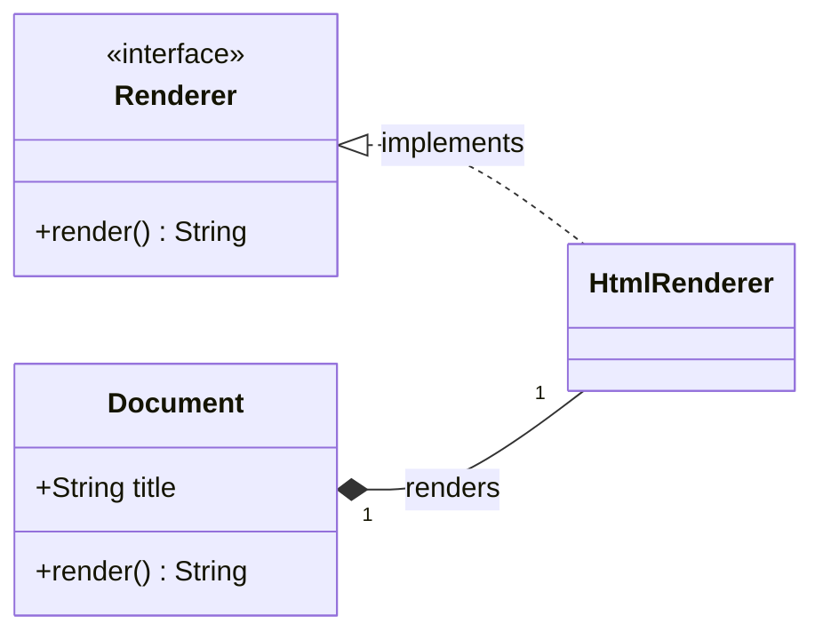
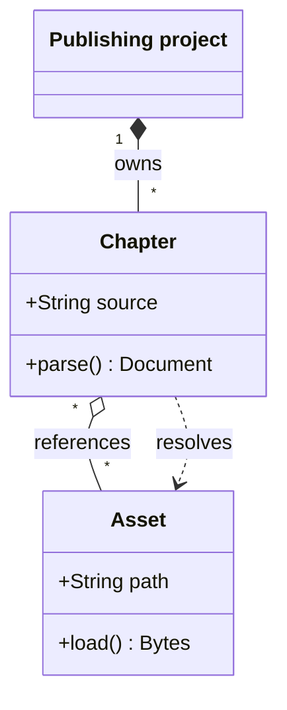

# Classes and relationships

These figures use the native compiler in HTML, PDF, SVG, EPUB and Flow.

## Rendering interface

```mermaid
classDiagram
    direction LR
    class Document {
        +String title
        +render() String
    }
    class Renderer {
        <<interface>>
        +render() String
    }
    Renderer <|.. HtmlRenderer : implements
    Document "1" *-- "1" HtmlRenderer : renders
```

## Ownership and reuse

```mermaid
classDiagram
    class Project["Publishing project"]
    class Chapter {
        +String source
        +parse() Document
    }
    class Asset {
        +String path
        +load() Bytes
    }
    Project "1" *-- "*" Chapter : owns
    Chapter "*" o-- "*" Asset : references
    Chapter ..> Asset : resolves
```
