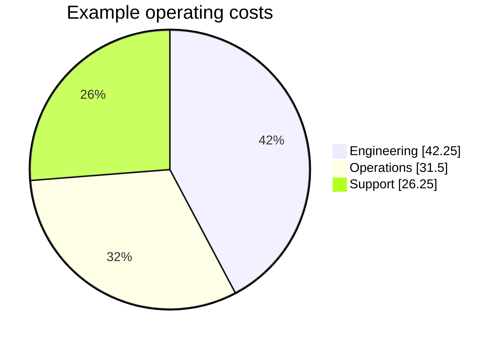
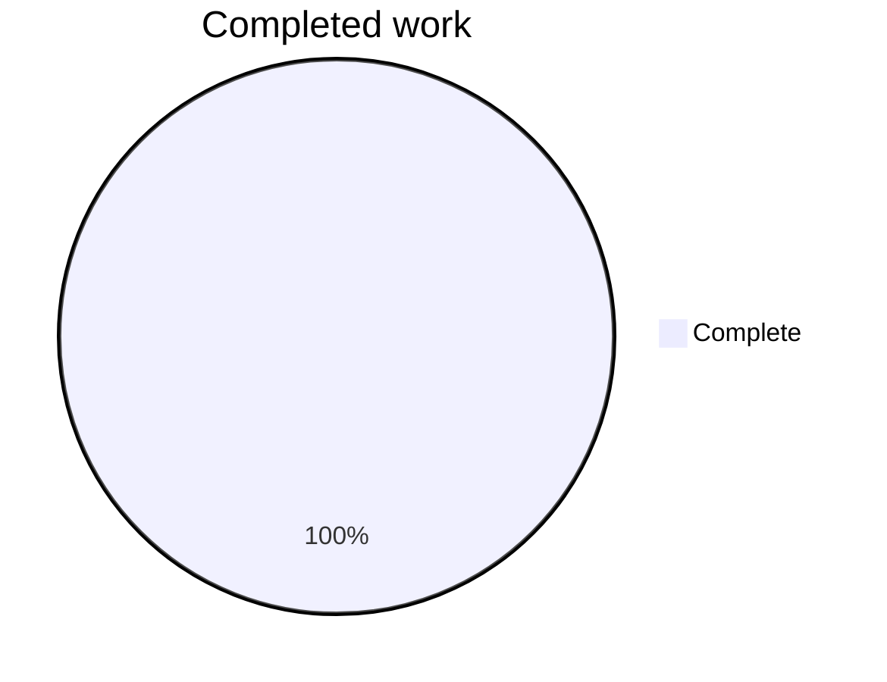
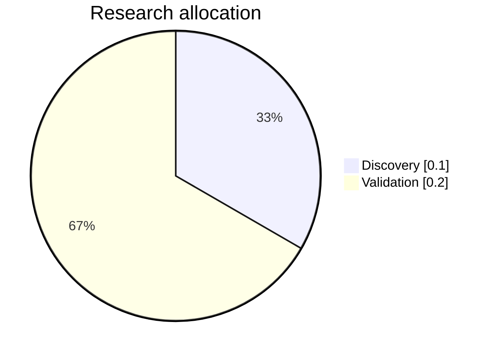

# Native pie charts

These illustrative allocations render directly as vector figures in HTML,
PDF, SVG, and EPUB.

```mermaid
pie showData title Example operating costs
    "Engineering" : 42.25
    "Operations" : 31.50
    "Support" : 26.25
```

## A complete allocation

```mermaid
pie title Completed work
    "Complete" : 100
```

## Exact decimal inputs

```mermaid
%% Decimal values are accumulated in integer hundredths.
pie showData
    title Research allocation
    "Discovery" : 0.10
    "Validation" : 0.20
```
