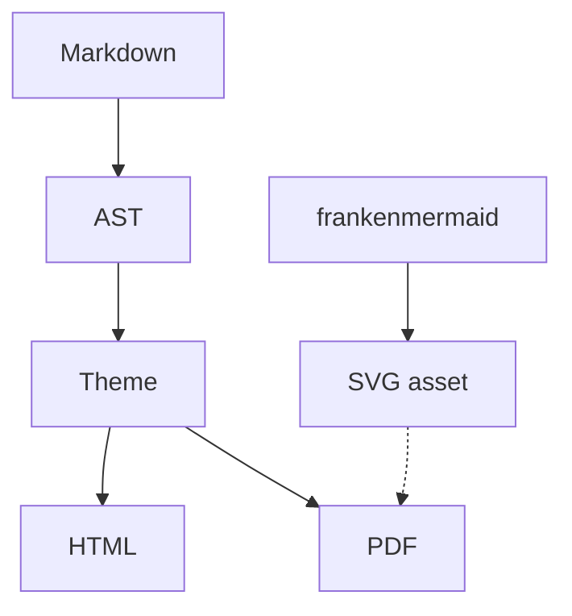

# franken_markdown

A clean-room, **zero-dependency** Rust engine that turns Markdown into a
gorgeous self-contained HTML page *and* a professional-typography PDF — with
embedded subset fonts, real kerning, ligatures, and LaTeX-grade line breaking.
This document is the visual gauntlet: if it renders beautifully, the engine works.

## Inline formatting

You get **bold**, *italic*, ***bold italic***, `inline code`, and
~~strikethrough~~ — composably, so you can write ***`bold-italic code`*** or a
**bold link to [the docs](https://example.com)** inside a sentence. Emphasis
nests correctly: **bold with *italic* inside**, *italic with **bold** inside*,
and the tricky **bold *italic*** closing run all resolve the way CommonMark says.

Links come in three flavors — an inline [link](https://example.com "tooltip"), a
reference [link][home], and a bare autolink like <https://rust-lang.org> or even
https://example.com/path?q=1 in running text. Hard breaks work too —
this line ends with two spaces and wraps to a new line.

[home]: https://example.com "Home"

## Lists, nested and mixed

Unordered lists nest cleanly:

- Top-level bullet with a fair amount of text so the line wraps and the
  Knuth–Plass breaker has a real paragraph to optimize across the measure.
  - A nested bullet
    - A doubly-nested bullet
  - Back to one level of nesting
- Another top-level item

Ordered lists keep their counters and nest too:

1. First step
2. Second step
   1. A sub-step
   2. Another sub-step
3. Third step

Task lists track state:

- [x] Parse the document into an AST
- [x] Shape glyphs with kerning and ligatures
- [x] Knuth–Plass line breaking
- [ ] Liang hyphenation

## Tables

GFM pipe tables become measured-column grids with per-cell alignment:

| Feature            | Status    |                         Notes |
| :----------------- | :-------: | ----------------------------: |
| HTML output        | working   |         all-in-one, themeable |
| PDF output         | working   |   embedded fonts, kerning, KP |
| Syntax highlight   | working   |     a dozen-plus languages    |
| Zero dependencies  | yes       |     the engine has no crates  |

A second, denser table to stress column measuring:

| Lang   | Kind      | Highlighted |
| :----- | :-------- | :---------: |
| Rust   | systems   | yes         |
| Python | scripting | yes         |
| JSON   | data      | yes         |
| TOML   | config    | yes         |

## Diagrams

The same document can carry a Mermaid source block and a frankenmermaid-rendered
SVG asset. HTML displays the SVG directly; file-input PDF renders auto-load the
same sibling SVG file and draw the diagram as vector content with selectable
labels.




## Blockquotes

> Blockquotes get a soft accent bar and a tinted background, and they wrap
> across multiple lines just like a real preview pane would render them.
>
> > Nested quotes indent further, so threaded commentary stays readable even a
> > couple of levels deep.

## Code blocks

Fenced code blocks sit on a rounded panel with **clean-room syntax highlighting**
for the languages that actually show up in technical writing.

```rust
fn fibonacci(n: u32) -> u64 {
    let (mut a, mut b) = (0u64, 1u64);
    for _ in 0..n {
        (a, b) = (b, a + b); // tuple-destructuring update
    }
    a // the nth Fibonacci number
}
```

```python
def fibonacci(n: int) -> int:
    a, b = 0, 1
    for _ in range(n):
        a, b = b, a + b  # parallel assignment
    return a
```

```json
{
  "engine": "franken_markdown",
  "deps": 0,
  "outputs": ["html", "pdf"],
  "fast": true
}
```

```bash
# Render this document to a PDF
fmd render examples/showcase.md --to pdf --out showcase.pdf
```

---

That's the tour. Everything above is rendered by hand-written, dependency-free
Rust — the parser, the syntax highlighter, the font subsetter, and the PDF
writer are all our own code.
